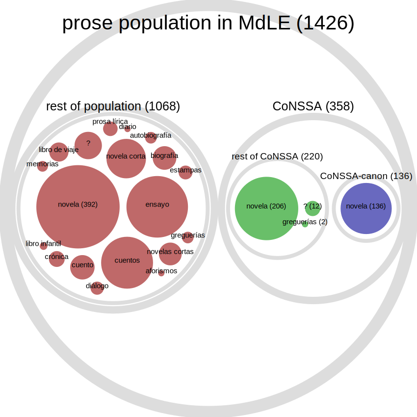
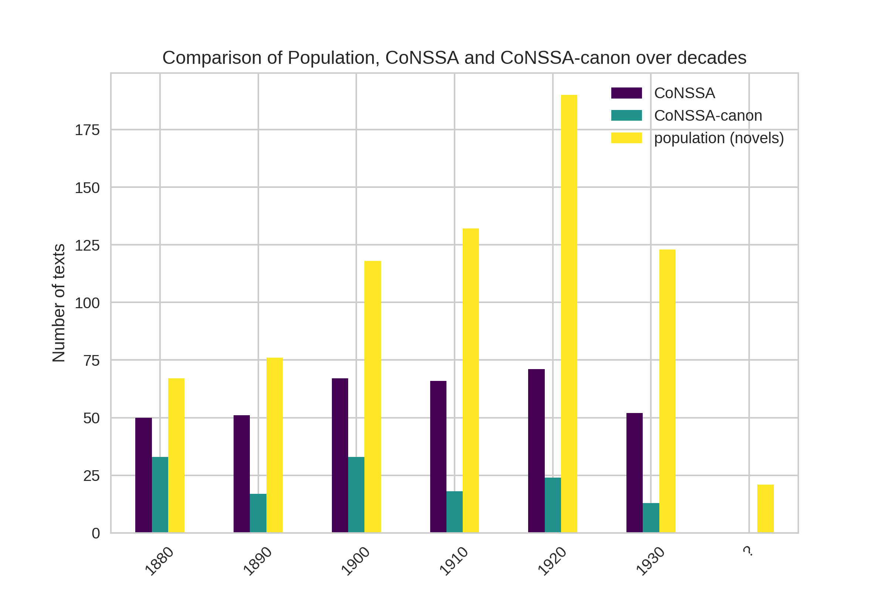

# CoNSSA: Corpus of Novels of the Spanish Silver Age

The *Corpus of Novels of the Spanish Silver Age* (CoNSSA) was designed and compiled by José Calvo Tello.

## Overview
This is part of my PhD thesis at the young research group *Computational Literary Genre Stylistics* (CLiGS), at the University of Würzburg (Germany). This project (2015-2020) was led by Christof Schöch, at the Professorship of Fotis Jannidis.

## License 

**The texts themselves are in the public domain.** They are provided here with the <a href="https://creativecommons.org/publicdomain/mark/1.0/">Public Domain Mark Declaration</a> and can be re-used without restrictions. **The XML-TEI markup and the metadata are published with a <a href="https://creativecommons.org/licenses/by/4.0/">Creative Commons Attribution 4.0 International licence CC-BY</a>.**

## How to Cite this Corpus

If you use texts or metadata from this collection for your research or teaching, reference this repository using the citation suggestions below and/or cite the reference publication indicated below:

- **_Corpus of Novels of the Spanish Silver Age (CoNSSA)_, by Calvo Tello, José. University of Würzburg, 2020. <https://github.com/cligs/conssa>**

## Description

The corpus contains in total 358 novels by Spanish authors published between 1880 and 1939. The corpus is designed considering the data of two authoritative Histories of Literature: . These Histories represent a specification of the population of literature of this period. A subsection of the corpus (*CoNSSA-canon*) is considered a representative population of the most important novels of this period.

The next figure shows a diagram of the original population of novels, the different sections of the corpus and their main genres:

The corpus contains 26.7 million tokens. This makes this corpus one of the largest corpora available, and possibily the largest one encoded in XML-TEI in Spanish. Here a comparison of both versions of the corpora (CoNSSA and CoNSSA-canon) and other known corpora of fiction:

Each text has been encoded in XML-TEI and enriched with several types of metadata (administrative, genre labels, literary information about the plot, etc.). Each file is also offered linguistically annotated with morphological, syntactic, semantic, and textual layers, including the difference between narrative direct speech passages. Moreover, the texts are offered in other formats such as plaintext (TXT).

However, a number of the texts cannot be published  yet due to copyrights. For this reason, 61% of the novels are currently offered in the formats described in the previous paragraph.

Following Schöch et al. (2020), I publish also extracted data for the texts that are already in public domin or that I have digitized by myself. This data is saved as parquet files, in which the rows are texts and each columns represent the frequency of the features in each text.

The purpose of the corpus is to analyze subgenres of the novels in this period: adventure, erotic, realistic novel, etc. However, as explained below and in the Chapter 3.1., the distribution of the texts in these subgenre played a little role in the corpus composition. That is why this corpus could be used to analyze other research questions, such as the stylistic development of specific authors in their novels, textual and literary comparison between authors or groups of authors, etc.

In a simplistic overview, the compilation of this corpus was my main task during the first three years of my PhD. This comprehended tasks such as searching for texts in differnt catalogues, gathering texts, converting them into TEI, annotating metadata, cleaning collecting labels from several sources, etc. In the fourth year the analysis was the main goal, while in the fifth I wrote the PhD. The fact that the Digital Humanists have to spend so much time preparing data for their analysis needs to be recognized by the research community and properly financed by funding instituions.  Moreover, the data needs to be set so openly as possible, so other can use it for their projects.

## Further Documentation

This documenation file in the repositoy explains briefly some aspects of the corpus. The comprehensive documentation can be found in several chapter of my PhD thesis, specially :
- Chapter 3.1. Corpus of Novels of the Spanish Silver Age: CoNSSA and CoNSSA-canon
- Chapter 3.2. Metadata
- Chapter 4.1. Grammatical, Lexical, Semantic, and Textual Annotation

## Related Publications

### PhD Thesis 

- Calvo Tello, José. to be published. The Novel in the Spanish Silver Age: A Digital Analysis of Genre through Machine Learning. Würzburg.

### Description of the Corpus in Spanish

- Calvo Tello, José. 2021. «Corpus de novelas de la Edad de Plata, en XML-TEI». Signa: Revista de la Asociación Española de Semiótica 30 (0): 83-107. https://doi.org/10.5944/signa.vol30.2021.29299.

### Analyses Based on the Corpus

- Calvo Tello, José. 2020. «What Is a Genre? A Graph Unified Model of Categories, Texts, and Features». En . Ottawa: ADHO. https://hcommons.org/deposits/item/hc:31713/.
- Calvo Tello, José. 2020. «Tokens and multiwords: Evaluation of lexical units in classification of literary subgenre». En Phraséologie et stylistique de la langue littéraire Phraseology and Stylistics of Literary Language, editado por Ludwig Fesenmeier y Iva Novakova, 343-58. Berlin: Peter Lang. https://doi.org/10.3726/b17628.
- Calvo Tello, Jose. 2019. «Delta Inside Valle-Inclán: Stylometric Classification of Periods and Groups of His Novels». En Theorien von Autorschaft Und Stil in Bewegung: Stilistik Und Stilometrie in Der Romania, editado por Nanete Rißler-Pipka, 0:151-64. http://www.romanischestudien.de/index.php/rst/article/view/625.
- Calvo Tello, José. 2019. «Diseño de corpus literario para análisis cuantitativos». Revista de Humanidades Digitales 4 (0): 115-35. https://doi.org/10.5944/rhd.vol.4.2019.25187.
- Calvo Tello, José, Ulrike Henny-Krahmer, y Christof Schöch. 2018. «Textbox: análisis del léxico mediante corpus literarios». En Historia del léxico español y Humanidades digitales, 223-51. Peter Lang. https://dialnet.unirioja.es/servlet/articulo?codigo=7081640.
- Calvo Tello, José. 2017. «Estado de la digitalización de la Edad de Plata: un análisis cuantitativo». Revista de Humanidades Digitales 1 (0): 76-95. https://doi.org/10.5944/rhd.vol.1.2017.17089.
- Calvo Tello, José, Daniel Schlör, Ulrike Henny-Krahmer, y Christof Schöch. 2017. «Neutralising the Authorial Signal in Delta by Penalization: Stylometric Clustering of Genre in Spanish Novels». En , 181-83. Montréal: ADHO. https://dh2017.adho.org/abstracts/037/037.pdf.
- Schöch, Christof, Daniel Schlör, Popp Stefanie, Annelen Brunner, Ulrike Henny, y José Calvo Tello. 2016. «Straight Talk! Automatic Recognition of Direct Speech in Nineteenth-Century French Novels». En , 346-53. Kraków: ADHO. http://dh2016.adho.org/abstracts/31.

### Related Works

- Schöch, Christof, José Calvo Tello, Ulrike Henny-Krahmer, y Stefanie Popp. 2019. «The CLiGS textbox: Building and Using Collections of Literary Texts in Romance Languages Encoded in XML-TEI». Journal of the Text Encoding Initiative. https://journals.openedition.org/jtei/2085.
- Calvo Tello, José, Ulrike Henny-Krahmer, y Christof Schöch. 2018. «Textbox: análisis del léxico mediante corpus literarios». En Historia del léxico español y Humanidades digitales, 223-51. Peter Lang. https://dialnet.unirioja.es/servlet/articulo?codigo=7081640.

